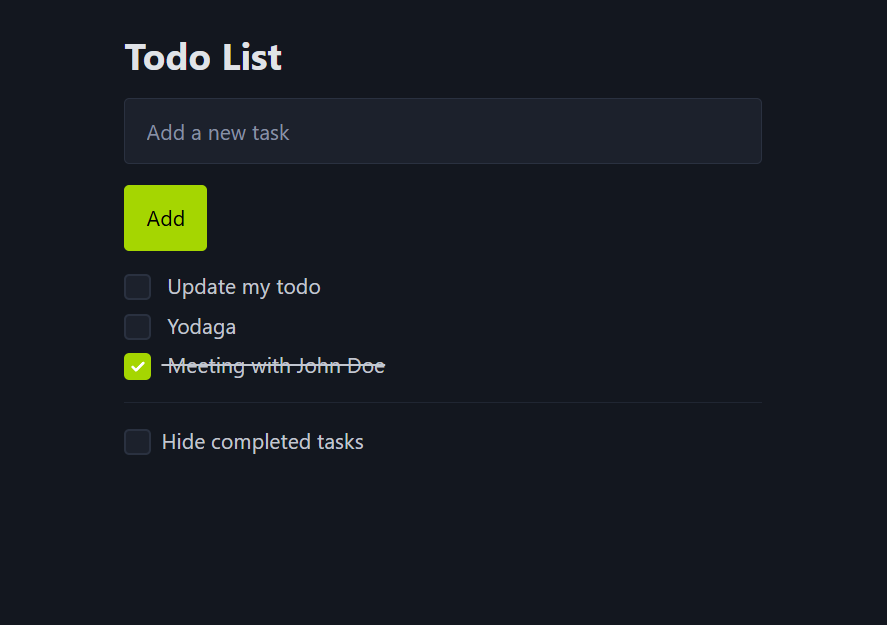

# TodoList

Cette application est une découverte de Vue.js, mettant en avant les concepts fondamentaux à travers une Todo List interactive et conviviale.



## Objectif

L'objectif principal est d'explorer les fonctionnalités de Vue.js en créant une application de gestion de tâches. Vous pourrez ajouter, supprimer et marquer des tâches comme complètes, tout en découvrant les bases de la réactivité et de la gestion d'état dans Vue.

## Fonctionnalités

- **Affichage dynamique** : Un message s'affiche si aucune tâche n'est présente.
- **Ajout de tâches** : Un champ texte et un bouton "Ajouter" permettent de créer de nouvelles tâches facilement.
- **Gestion des tâches** : Chaque tâche dispose d'une case à cocher pour indiquer son état (faite ou non).
- **Style visuel** : Les tâches complètes sont barrées grâce à des styles CSS.
- **Tri des tâches** : Les tâches à faire sont affichées en premier.
- **Masquage des tâches terminées** : Une case à cocher permet de masquer les tâches déjà complètes.

## Aide

Les tâches auront ce format :

```json
[
  {
    "title": "Tâche à faire",
    "completed": false,
    "id": 1020302103
  }
]
```

## Recommended IDE Setup

[VS Code](https://code.visualstudio.com/) + [Vue (Official)](https://marketplace.visualstudio.com/items?itemName=Vue.volar) (and disable Vetur).

## Recommended Browser Setup

- Chromium-based browsers (Chrome, Edge, Brave, etc.):
  - [Vue.js devtools](https://chromewebstore.google.com/detail/vuejs-devtools/nhdogjmejiglipccpnnnanhbledajbpd)
  - [Turn on Custom Object Formatter in Chrome DevTools](http://bit.ly/object-formatters)
- Firefox:
  - [Vue.js devtools](https://addons.mozilla.org/en-US/firefox/addon/vue-js-devtools/)
  - [Turn on Custom Object Formatter in Firefox DevTools](https://fxdx.dev/firefox-devtools-custom-object-formatters/)

## Type Support for `.vue` Imports in TS

TypeScript cannot handle type information for `.vue` imports by default, so we replace the `tsc` CLI with `vue-tsc` for type checking. In editors, we need [Volar](https://marketplace.visualstudio.com/items?itemName=Vue.volar) to make the TypeScript language service aware of `.vue` types.

## Customize configuration

See [Vite Configuration Reference](https://vite.dev/config/).

## Project Setup

```sh
npm install
```

### Compile and Hot-Reload for Development

```sh
npm run dev
```

### Type-Check, Compile and Minify for Production

```sh
npm run build
```
